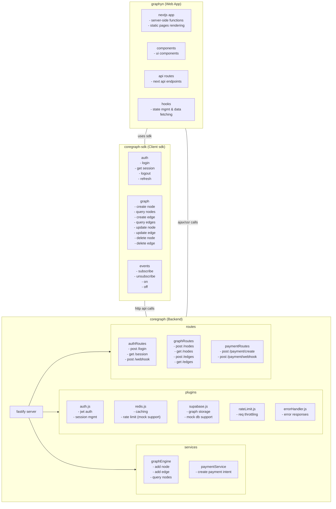

# Consolidated System Documentation

This document consolidates the documentation from graphyn, node, and coregraph, organized around the system architecture as described in the architecture diagram. It centralizes our API, development guidelines, deployment, security, and project structure details.

## 1. Architecture Overview

The following diagram presents the core architecture of our system:

## 2. API and Integration

- **API Documentation:**
  - Refer to `api.md` (graphyn) for client-side API usage.
  - `openapi.yaml` and `api-reference.md` (coregraph) detail the backend API endpoints, request/response formats, and integration methods.

## 3. Development Guidelines

- **Frontend:**
  - See `development.md` (graphyn/docs) for frontend development best practices.
- **Backend:**
  - Consult `development-guide.md` (coregraph/docs) for backend development guidelines.
- **SDK:**
  - `sdk-todo.md` (node/docs) covers pending improvements and todos for the client SDK.

## 4. Deployment and Security

- **Deployment:**
  - `deployment-handbook.md` (coregraph/docs) outlines deployment processes and infrastructure setup.
- **Security:**
  - `security-specifications.md` (coregraph/docs) includes security policies and specifications.

## 5. Project Structure and Todos

- **Application Structure:**
  - Review `application-structure.md` and `proj.md` (graphyn/.docs) for an overview of the project organization.
- **Tasks and Todos:**
  - Additional tasks are listed in `todo.md` (graphyn/.docs) and `backend-todo.md` (coregraph/docs).

---

This consolidated document is based on the architecture outlined in the primary ARCHITECTURE.md and integrates key technical details from all repositories. It serves as a single source of truth for system design and operational guidelines. 