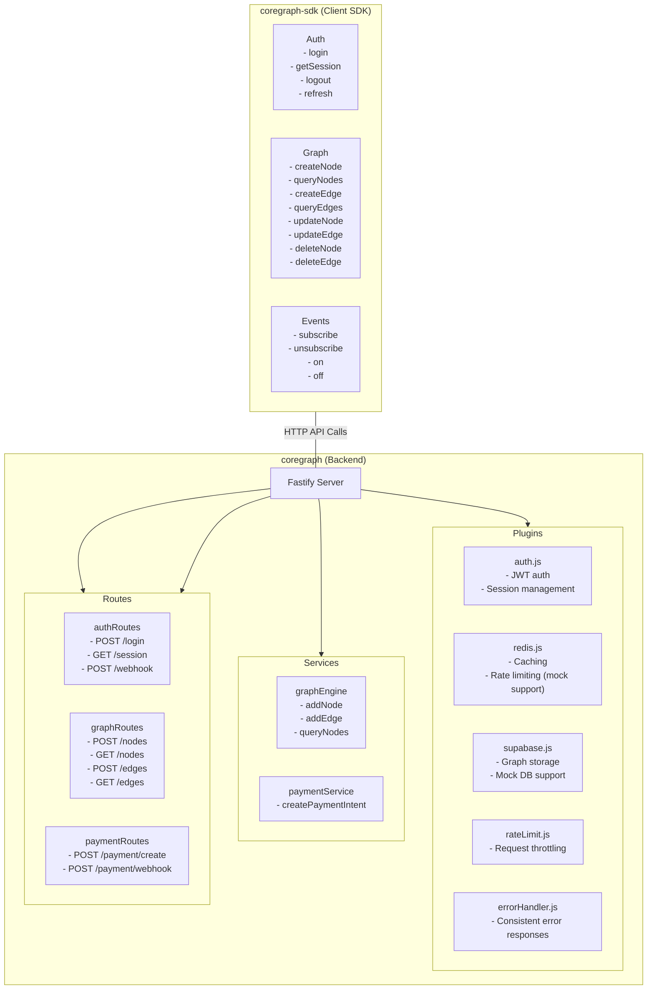
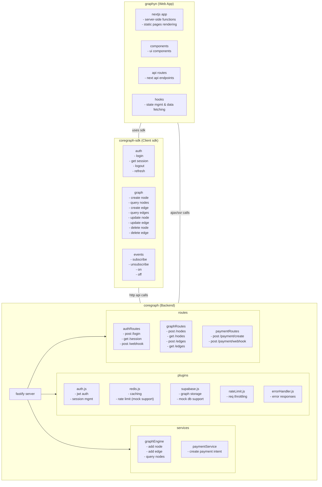
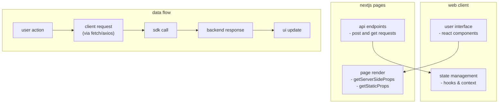

# Architecture Diagram

This diagram shows the services and methods of the coregraph backend and the coregraph-sdk client.

Review this diagram to verify that all services and their methods are correctly captured. 

<!-- appended extended architecture details -->

## extended architecture

### system overview

### web app detailed breakdown

### methods and flows

- backend: methods include add node, add edge, query nodes, create payment intent, etc.
- sdk: methods include login, get session, create node, etc.
- web app: interactions via nextjs api routes and client-side calls, integrating sdk calls and direct ajax. 

# architecture overview

welcome to the architecture overview for hotdocs. this document is designed for the graphyn community, helping developers integrate graphyn service apis into their applications.

## system components

- **backend**: a node-based service exposing graphyn endpoints for data transformation and analytics. see the [backend api documentation](/api/backend) for details.
- **frontend**: provides realtime updates and widget configurations to enhance your app's user experience. detailed info in [frontend api documentation](/api/frontend).
- **database & middleware**: ensure secure data management and reliable request routing.

## integration with graphyn service

graphyn service apis empower you to:

- transform data via the **transform endpoint**: POST `/api/graphyn/transform`
- retrieve analytical insights from the **analytics endpoint**: GET `/api/graphyn/analytics`

## deployment & scalability

our solution is containerized and can be deployed using docker or kubernetes, ensuring high scalability and availability. for deployment instructions, refer to our [docs](/docs).

## further reading

- [backend api documentation](/api/backend)
- [frontend api documentation](/api/frontend)
- [guides](/getting-started)

this overview consolidates the core technical architecture of hotdocs, ensuring you have the essential details to effectively integrate graphyn service into your applications. 