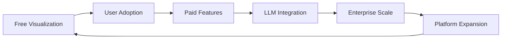
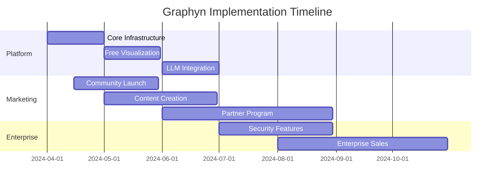

# **Graphyn Business Plan & Strategy**

## **TL;DR: PLATFORM STRATEGY**

Graphyn aims to revolutionize how businesses understand and interact with their users through a powerful combination of graph databases, vector search, and LLM-driven automation. Our strategy focuses on providing immediate value through free visualization tools while building a comprehensive platform for user interaction analysis and automation.

### **Why We Are Doing This**

In today's digital landscape, businesses struggle with three core challenges:

1. Understanding complex user interactions across multiple touchpoints
2. Automating decisions without compromising safety or user trust
3. Meeting increasingly strict data privacy requirements while maintaining personalization

Graphyn solves these by providing a unified platform that maps user interactions in a graph database, enables safe LLM-based automation, and gives users complete control over their data.

### **How We'll Execute the Overall Strategy**

1. **Hook Users with Free Value**: Provide powerful graph visualization tools that demonstrate immediate value.
2. **Enable Safe Automation**: Implement LLM-powered features with 95% accuracy within clear business rules.
3. **Ensure User Control**: Build trust through transparent data handling and user sovereignty.
4. **Scale Through Integration**: Partner with key platforms and expand use cases methodically.

### **Strategy Diagram**

---

## **2024 Q2 Targets**

### **TAR-001: Platform Launch (Apr 30, 2024)**

- **Goal:** Launch production-ready platform with core features
- **Actions:**
  - **ACT-001:** Deploy Memgraph instance for graph database
  - **ACT-002:** Integrate Qdrant for vector search capabilities
  - **ACT-003:** Set up RabbitMQ for async task processing
  - **ACT-004:** Launch free visualization tool
  - **ACT-005:** Implement basic user authentication

### **TAR-002: Initial User Base (May 31, 2024)**

- **Goal:** Acquire 1,000 free users and convert 50 to paid plans
- **Actions:**
  - **ACT-006:** Launch developer community program
  - **ACT-007:** Create educational content series
  - **ACT-008:** Implement referral system
  - **ACT-009:** Host virtual demo sessions

### **TAR-003: LLM Integration (Jun 30, 2024)**

- **Goal:** Launch LLM-powered features with 95% accuracy
- **Actions:**
  - **ACT-010:** Implement LLM action framework
  - **ACT-011:** Create business rules engine
  - **ACT-012:** Set up monitoring and safety controls
  - **ACT-013:** Launch beta testing program

### **TAR-004: Enterprise Features (Jun 30, 2024)**

- **Goal:** Release enterprise-grade features and security
- **Actions:**
  - **ACT-014:** Implement RBAC and SSO
  - **ACT-015:** Set up audit logging
  - **ACT-016:** Create compliance documentation
  - **ACT-017:** Launch enterprise pricing tier

---

## **Business Plan Funnel with Quantified Metrics**

### **1. Market Analysis**

- **Total Addressable Market (TAM):** 500,000 businesses needing advanced analytics
- **Serviceable Available Market (SAM):** 100,000 businesses with technical capability
- **Serviceable Obtainable Market (SOM):** 10,000 businesses in first year
- **Initial Target:** 1,000 active users in Q2 2024

### **2. Services & Product Line**

**Core Platform Features:**

1. **Graph Database (Memgraph)**
   - User interaction mapping
   - Relationship analysis
   - Pattern detection
   - Query performance: <50ms for common operations

2. **Vector Search (Qdrant)**
   - Semantic similarity search
   - Recommendation engine
   - Query performance: <100ms for vector operations
   - Storage efficiency: 1M vectors per GB

3. **Async Processing (RabbitMQ)**
   - Task queue management
   - Data ingestion pipeline
   - Background processing
   - Throughput: 10,000 messages/second

4. **LLM Action Framework**
   - Business rule validation
   - Automated decision-making
   - Safety constraints
   - Response time: <1s for standard actions

### **3. Unit Economics**

#### **Customer Segments & Pricing**

| Plan     | Monthly Fee | Storage | Actions/mo | Support    |
|----------|------------|---------|------------|------------|
| Free     | $0         | 5GB     | 1,000      | Community  |
| Growth   | $250       | 50GB    | 10,000     | Email      |
| Scale    | $500       | 250GB   | Unlimited  | Priority   |

#### **Cost Structure**

**Per Customer Costs (Monthly):**

- Storage: $0.10/GB
- Compute: $0.05/1000 operations
- Support: $20/ticket (avg)

**Fixed Costs (Monthly):**

- Infrastructure: $5,000
- Team: $40,000
- Marketing: $10,000

#### **Key Metrics**

- **CAC:** $800 per paying customer
- **LTV:** $6,250 (25 months × $250 blended revenue)
- **LTV:CAC Ratio:** 7.8
- **Gross Margin:** 80%
- **Target Churn:** <4% monthly

### **4. Financial Projections**

#### **Year 1 Growth Model**

| Month | Free Users | Paid Users | MRR     | Costs    | Net     |
|-------|------------|------------|---------|----------|---------|
| 1     | 100        | 5          | $1,250  | $10,000  | -$8,750 |
| 2     | 250        | 13         | $3,250  | $12,000  | -$8,750 |
| 3     | 500        | 25         | $6,250  | $15,000  | -$8,750 |
| Q2    | 1,000      | 50         | $12,500 | $20,000  | -$7,500 |
| Q3    | 2,500      | 125        | $31,250 | $35,000  | -$3,750 |
| Q4    | 5,000      | 250        | $62,500 | $50,000  | $12,500 |

#### **Three-Year Projection**

| Year | Free Users | Paid Users | ARR      | Costs     | Net      |
|------|------------|------------|----------|-----------|----------|
| 1    | 5,000      | 250        | $750K    | $600K     | $150K    |
| 2    | 20,000     | 1,000      | $3M      | $2M       | $1M      |
| 3    | 50,000     | 2,500      | $7.5M    | $4M       | $3.5M    |

### **5. Go-to-Market Strategy**

#### **Phase 1: Developer Adoption**

1. **Community Building**
   - Open-source tools
   - Technical blog posts
   - Developer events
   - Cost: $5K/month

2. **Content Marketing**
   - Tutorial series
   - Case studies
   - Integration guides
   - Cost: $3K/month

3. **Partnership Program**
   - Technology partners
   - Integration partners
   - Referral partners
   - Cost: $2K/month

#### **Phase 2: Enterprise Expansion**

1. **Sales Development**
   - Enterprise sales team
   - Solution architects
   - Custom demos
   - Budget: $20K/month

2. **Marketing Programs**
   - Industry events
   - Webinar series
   - Customer success stories
   - Budget: $15K/month

### **6. Risk Analysis & Mitigation**

| Risk Category | Description | Probability | Impact | Mitigation |
|---------------|-------------|-------------|---------|------------|
| Technical     | Performance degradation | Medium | High | Auto-scaling, monitoring |
| Market        | Low adoption rate | Medium | High | Free tier optimization |
| Competition   | New entrants | High | Medium | Feature differentiation |
| Regulatory    | Privacy laws | High | High | Compliance-first design |

### **7. Implementation Timeline**

### **8. Success Metrics**

| Metric | Q2 2024 | Q3 2024 | Q4 2024 | 2025 |
|--------|---------|---------|---------|------|
| MAU    | 1,000   | 2,500   | 5,000   | 20,000|
| Paid   | 50      | 125     | 250     | 1,000 |
| ARR    | $150K   | $375K   | $750K   | $3M   |
| CAC    | $1,000  | $900    | $800    | $700  |
| LTV    | $5,000  | $5,500  | $6,000  | $7,500|

---

## **Strategic Action Responsibility Matrix**

| Action ID | Description | Owner | Deadline | Status |
|-----------|-------------|-------|----------|--------|
| ACT-001   | Deploy Memgraph | TBD | Apr 15 | Planning |
| ACT-002   | Integrate Qdrant | TBD | Apr 15 | Planning |
| ACT-003   | Set up RabbitMQ | TBD | Apr 15 | Planning |
| ACT-004   | Launch visualization | TBD | Apr 30 | Planning |
| ACT-005   | Basic auth | TBD | Apr 30 | Planning |
| ACT-006   | Dev community | TBD | May 15 | Planning |
| ACT-007   | Content series | TBD | May 15 | Planning |
| ACT-008   | Referral system | TBD | May 30 | Planning |
| ACT-009   | Demo sessions | TBD | May 30 | Planning |
| ACT-010   | LLM framework | TBD | Jun 15 | Planning |
| ACT-011   | Rules engine | TBD | Jun 15 | Planning |
| ACT-012   | Safety controls | TBD | Jun 30 | Planning |
| ACT-013   | Beta program | TBD | Jun 30 | Planning |
| ACT-014   | RBAC & SSO | TBD | Jun 30 | Planning |
| ACT-015   | Audit logging | TBD | Jun 30 | Planning |

---

## **Conclusion**

Graphyn's strategy combines immediate value delivery through free visualization tools with a clear path to monetization via advanced features. The platform's focus on user data sovereignty and safe automation addresses key market needs while building trust. With a strong unit economics foundation (LTV:CAC of 7.8) and clear execution plan, we're well-positioned to capture significant market share in the growing data analytics and automation space.

## Technical Architecture

### System Overview

[System diagram showing Client App -> Graphyn API -> Memgraph -> LLM Service flow]

## Market Size

### Market Opportunity
