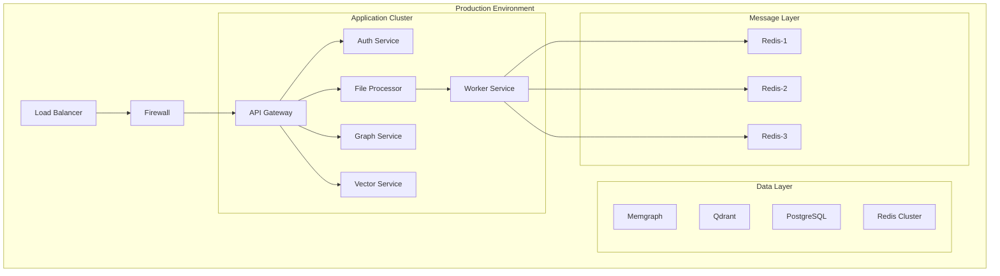
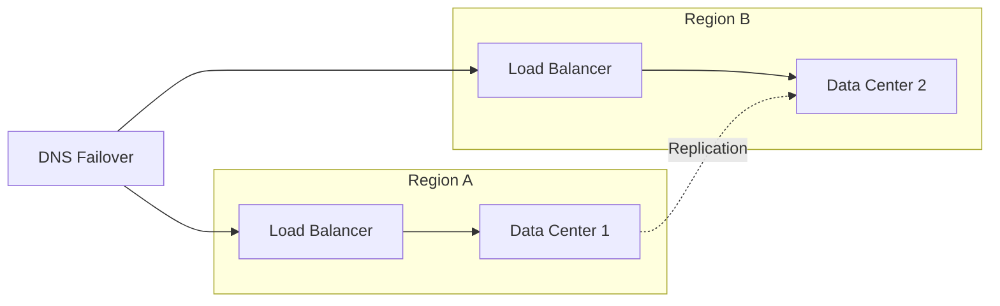
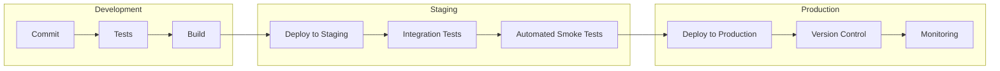
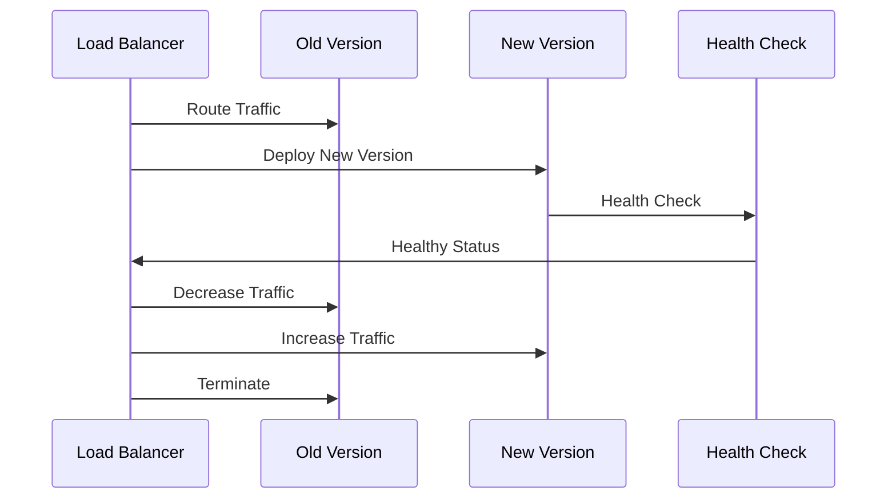
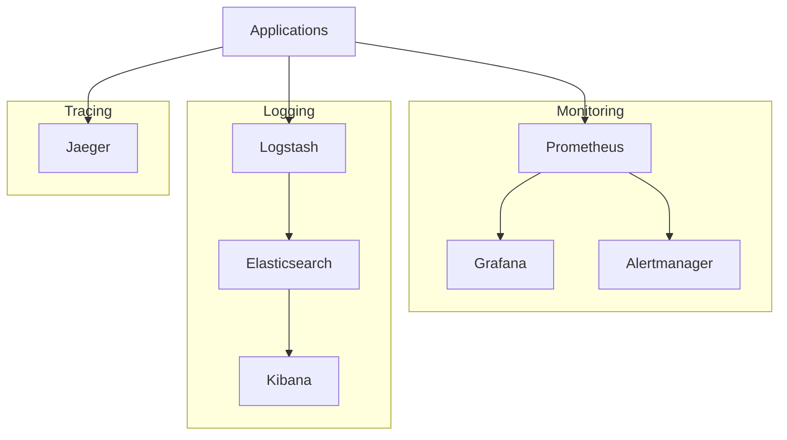
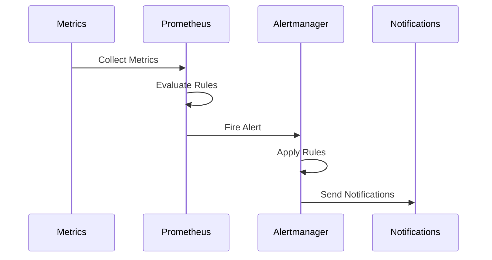
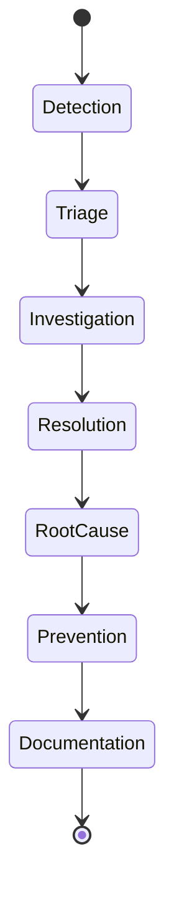
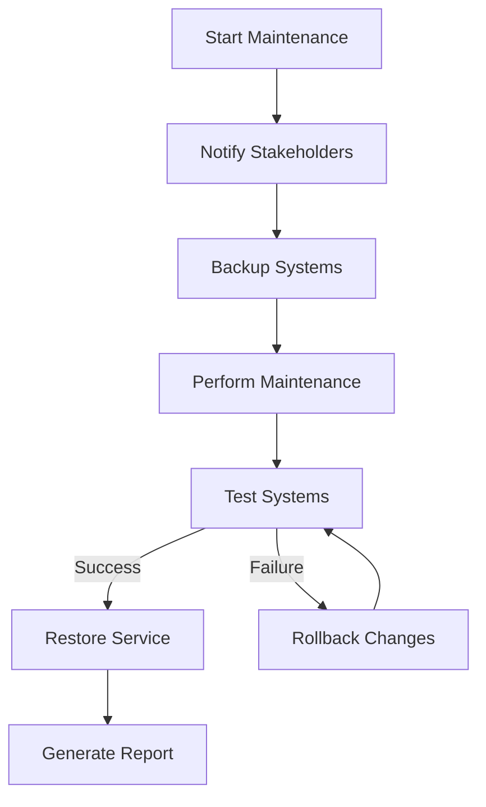
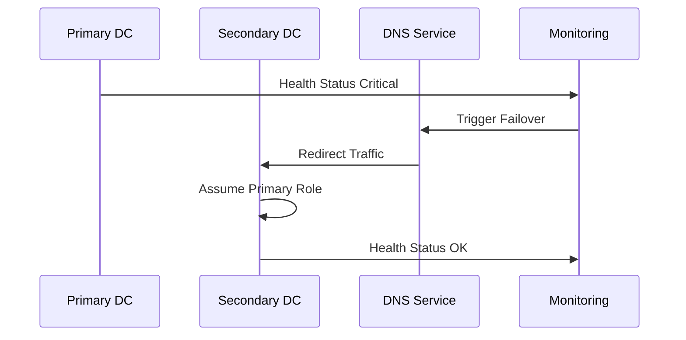
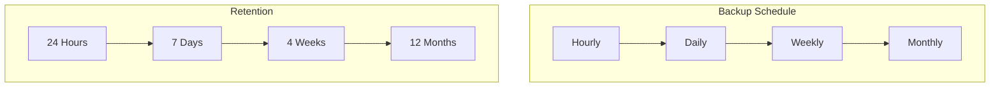

# Deployment Handbook

## Table of Contents
1. [Infrastructure Overview](#infrastructure-overview)
2. [System Architecture](#system-architecture)
3. [Deployment Strategy](#deployment-strategy)
4. [Monitoring and Observability](#monitoring-and-observability)
5. [Operational Procedures](#operational-procedures)
6. [Disaster Recovery](#disaster-recovery)

## Infrastructure Overview

### Cloud Infrastructure

## System Architecture

### High Availability Setup

## Deployment Strategy

### CI/CD Pipeline

### Rolling Update Process

## Monitoring and Observability

### Monitoring Stack Architecture

### Alerting Workflow

## Operational Procedures

### Incident Response Flow

### Maintenance Window Procedure

## Disaster Recovery

### Recovery Process

### Backup Strategy

