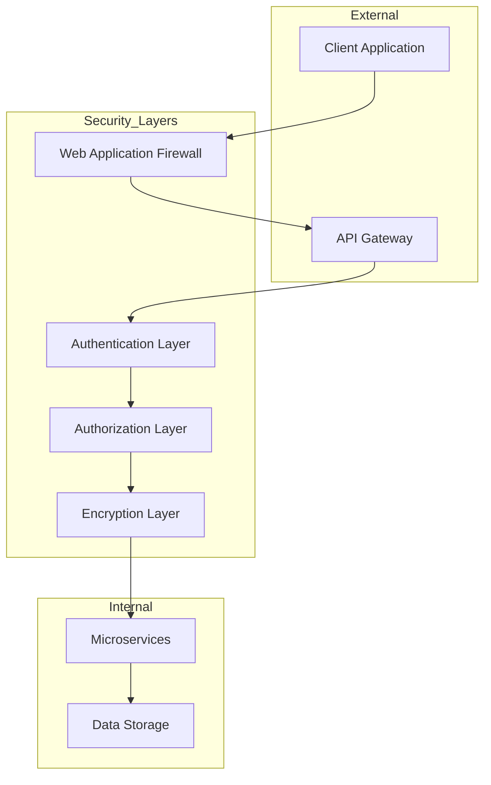
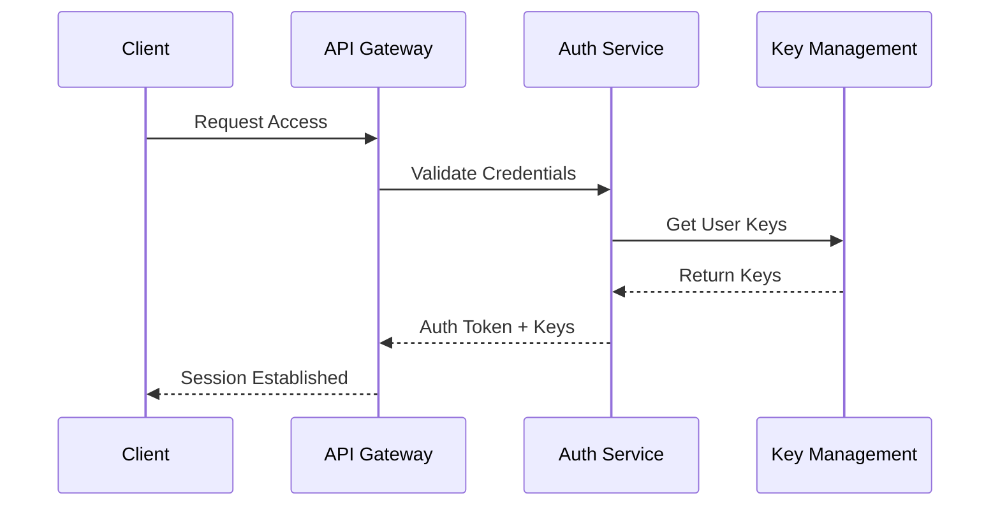
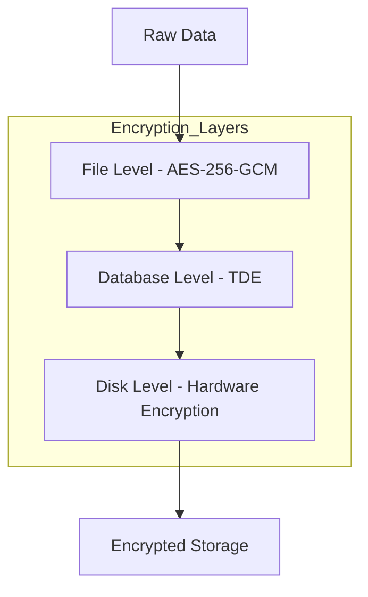
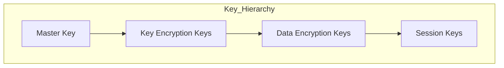
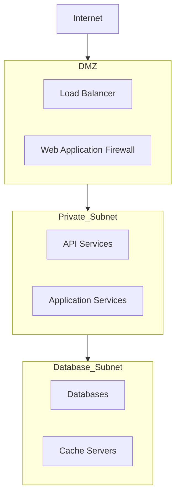
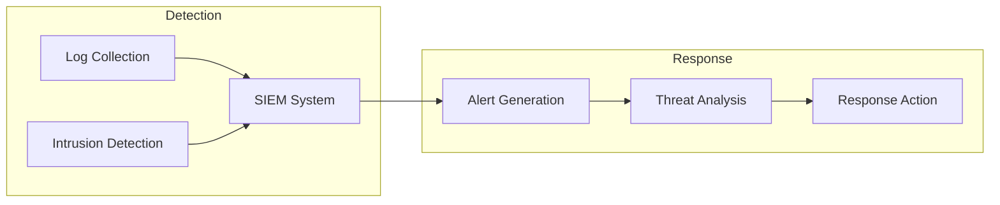

# Security Specifications

## Table of Contents
1. [Security Architecture Overview](#security-architecture-overview)
2. [Authentication and Authorization](#authentication-and-authorization)
3. [Encryption Protocols](#encryption-protocols)
4. [Key Management](#key-management)
5. [Network Security](#network-security)
6. [Security Best Practices](#security-best-practices)
7. [Monitoring and Incident Response](#monitoring-and-incident-response)

## Security Architecture Overview

The system implements a defense-in-depth approach with multiple security layers:



## Authentication and Authorization

### Authentication Flow



### Authorization Levels

- **User Roles**:
    - Admin: Full system access
    - Manager: Service management access
    - User: Basic service access
    - Guest: Read-only access

- **Permission Matrix**:
    ```mermaid
    graph LR
        subgraph Permissions
            Read[Read Operations]
            Write[Write Operations]
            Delete[Delete Operations]
            Admin[Admin Operations]
        end
        
        Guest --> Read
        User --> Read
        User --> Write
        Manager --> Read
        Manager --> Write
        Manager --> Delete
        Admin --> Read
        Admin --> Write
        Admin --> Delete
        Admin --> Admin
    ```

## Encryption Protocols

### Data at Rest



### Data in Transit

- TLS 1.3 for all external communications
- mTLS for service-to-service communication
- Perfect Forward Secrecy (PFS) enabled

### Encryption Specifications
- AES-256-GCM for file encryption
- RSA-4096 for key exchange
- SHA-512 for hashing
- Argon2id for password hashing

## Key Management

### Key Hierarchy



### Key Rotation Policy
- Master Keys: Annual rotation
- Data Encryption Keys: Quarterly rotation
- Session Keys: Daily rotation
- Immediate rotation on compromise

## Network Security

### Network Architecture



### Security Controls
- IP whitelisting
- Rate limiting
- DDoS protection
- Web Application Firewall (WAF)
- Network segmentation
- Regular security scans

## Security Best Practices

### Coding Standards
- Input validation
- Output encoding
- Parameterized queries
- Secure logging practices
- Error handling

### Access Control
- Principle of least privilege
- Role-based access control (RBAC)
- Multi-factor authentication (MFA)
- Session management
- Regular access reviews

## Monitoring and Incident Response

### Security Monitoring



### Incident Response Plan
1. Detection and Analysis
2. Containment
3. Eradication
4. Recovery
5. Post-Incident Analysis

### Security Metrics
- Mean time to detect (MTTD)
- Mean time to respond (MTTR)
- Security incident rate
- Vulnerability remediation time
- Security training completion rate

