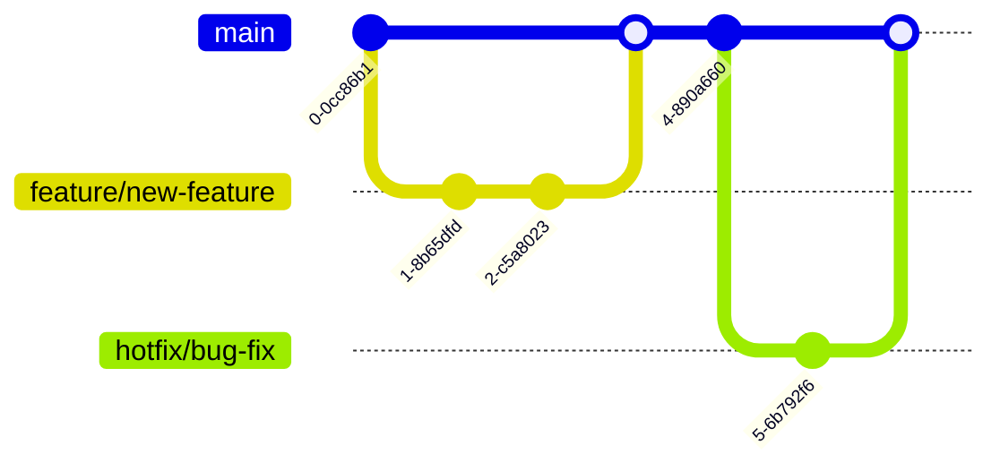

# Development Guide

This guide outlines development practices, workflows, and standards for contributing to the project.

## Table of Contents
- [Development Workflow](#development-workflow)
- [Coding Standards](#coding-standards)
- [Testing Strategy](#testing-strategy)
- [Version Control](#version-control)
- [Code Review Process](#code-review-process)
- [Contribution Guidelines](#contribution-guidelines)
- [Architecture Patterns](#architecture-patterns)

## Development Workflow

### Feature Development Process


### CI/CD Pipeline


## Coding Standards

### Code Organization


### Naming Conventions

- **Files**: lowercase with hyphens (e.g., `user-service.ts`)
- **Classes**: PascalCase (e.g., `UserService`)
- **Functions**: camelCase (e.g., `getUserById`)
- **Constants**: UPPER_SNAKE_CASE (e.g., `MAX_RETRY_COUNT`)
- **Variables**: camelCase (e.g., `userData`)

### Code Style

```typescript
// Example of preferred code style
class UserService {
    private readonly maxRetries: number;

    constructor(config: ServiceConfig) {
        this.maxRetries = config.maxRetries;
    }

    async getUserById(id: string): Promise<User> {
        try {
            return await this.dbClient.users.findOne({ id });
        } catch (error) {
            this.logger.error('Failed to fetch user', { id, error });
            throw new ServiceError('UserNotFound');
        }
    }
}
```

## Testing Strategy

### Testing Pyramid


### Test Types

1. **Unit Tests**
- Test individual components in isolation
- Mock external dependencies
- Fast execution

2. **Integration Tests**
- Test component interactions
- Use test databases
- Verify service boundaries

3. **End-to-End Tests**
- Test complete user flows
- Run against staging environment
- Validate critical paths

## Version Control

### Branch Strategy



### Commit Message Format

```
<type>(<scope>): <description>

[optional body]

[optional footer]
```

Types: feat, fix, docs, style, refactor, test, chore

## Code Review Process


## Contribution Guidelines

### Getting Started

1. Fork the repository
2. Create a feature branch
3. Make changes following coding standards
4. Add tests
5. Submit pull request

### Pull Request Template

```markdown
## Description
[Describe changes]

## Type of Change
- [ ] Bug fix
- [ ] New feature
- [ ] Breaking change
- [ ] Documentation update

## Testing
- [ ] Unit tests added
- [ ] Integration tests added
- [ ] Manually tested
```

## Architecture Patterns

### Service Communication


### Event-Driven Architecture


